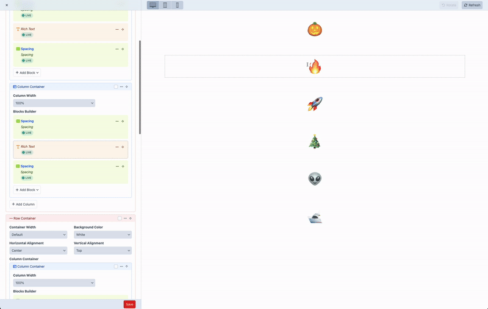

# PreviewMate v4

Find live preview matrix blocks with ease.

## Requirements
This plugin supports Craft CMS 5.x

## Installation
To install the plugin, follow these instructions.

1. Open your terminal and go to your Craft project:

    cd /path/to/project

2. Then tell Composer to load the plugin:

    composer require nicholashamilton/craft-preview-mate

3. In the Control Panel, go to Settings → Plugins and click the “Install” button for PreviewMate.

## How to use



Preview blocks will be tracked in live preview by adding `data-preview-block-id` attribute to the entry's HTML element.

```twig
{# option 1 (recommended) - only rendered in live preview #}
{{ craft.previewMate.previewBlock(entry) }}
```
or
```twig
{# option 2 - manually set the preview block id #}
data-preview-block-id="{{ entry.id }}"
```

Clicking a preview block will now scroll to and highlight the editor block.

## Usage example 

```twig
{# Matrix field #}


{# Render blocks #}

    <div {{ craft.previewMate.previewBlock(block) }}>
        {{ block.render() }}
    </div>

```

It's recommended to add styles for preview blocks using `data-preview-block-id`.
Adding the following styles will highlight the preview block on hover.

```css
[data-preview-block-id] {
    position: relative;
}
[data-preview-block-id]::after {
    content: '';
    position: absolute;
    top: 0;
    left: 0;
    width: 100%;
    height: 100%;
    border: 1px dashed rgba(0, 0, 0, .333);
    pointer-events: none;
    opacity: 0;
    transition: opacity 300ms ease;
}
[data-preview-block-id].preview-block-hover::after {
    opacity: 1;
}
```